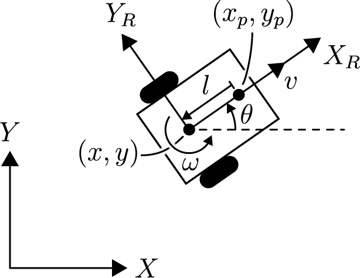
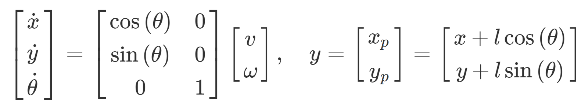
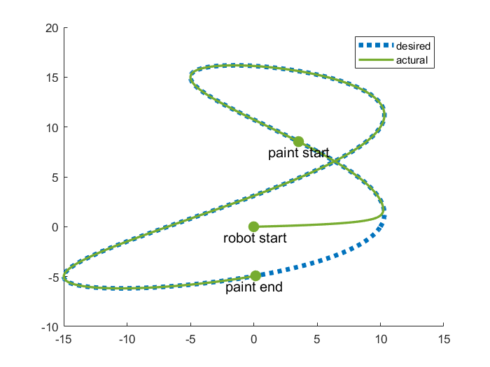

# Trajectory Tracking with a Mobile Robot

Considering  v  and  ω  as the control inputs to the system, the nonlinear state space equations are given by:

Where  (x,y,θ)  is the position of the robot and  (xp, yp)  is the position of the paint sprayer.

Implement a control law to drive the robot such that the location of the paint sprayer follows the trajectory given below:

## Result

